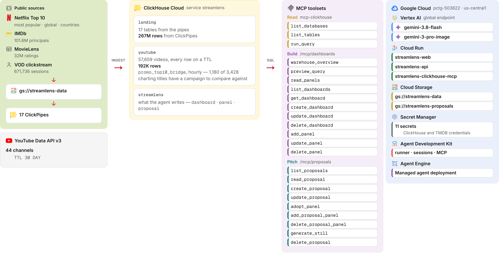

# Streamlens

Streamlens is an analytics and theme-proposal tool that lets **non-technical filmmakers harness ClickHouse through Gemini**. The warehouse holds ~268 million rows of public streaming signal — Netflix's Weekly Top 10, the 44 YouTube channels that promote it, IMDb, TMDB, MovieLens. The filmmaker writes no SQL, opens no table, and files no request with strategy. They ask in plain language.

From that one question, filmmakers can investigate where audience heat is forming, set a promotional push against what actually charted, see which markets already claimed a title, and turn the answer into a **theme proposal** — logline, budget band, character archetypes, a generated hero still — with the charts that justify it adopted into the pitch itself.



## Run

**Prerequisites:** Python 3.11+ with [uv](https://docs.astral.sh/uv/), Node 20+,
a ClickHouse Cloud service, and a Google Cloud project with Vertex AI enabled.

Create `secrets/` (git-ignored) with:

| File | Contents |
|---|---|
| `clickhouse.env` | `CLICKHOUSE_HOST`, `CLICKHOUSE_USER`, `CLICKHOUSE_PASSWORD` |
| `pctg-sa.json` | Google Cloud service-account key with Vertex AI access |
| `youtube.env` | `YOUTUBE_API_KEY` restricted to `youtube.googleapis.com` |
| `gcs.env` | HMAC credentials for ClickPipes against the raw bucket |

```bash
cd backend && uv sync
uv run uvicorn streamlens.api:app --port 8000

cd web && npm install && npm run dev
```

Open http://localhost:3000 and ask the analyst a question in Studio. The same
app is live at https://streamlens-web-148137280149.us-central1.run.app — the
URL belongs to the Cloud Run service, so a redeploy does not change it.

`GET /health` confirms the ClickHouse connection. `GET /api/queries` lists
every named query the rooms can run.

## Layout

```
.
├── README.md
├── LICENSE
├── docs/
│   └── architecture.png      the figure above, drawn from /diagram
│
├── backend/
│   ├── pyproject.toml
│   ├── streamlens/
│   │   ├── config.py         settings; reads ../secrets/*.env, env wins
│   │   ├── services/         one directory per platform, one registry each
│   │   │   ├── gcp/          gcp_services.py — every Google Cloud call
│   │   │   └── clickhouse/   clickhouse_services.py — every ClickHouse call
│   │   ├── dashboards/       panel spec, chart registry, store, tool surface
│   │   ├── proposals/        one-sheet doc, store, stills, tool surface
│   │   ├── mcp/              the two in-repo MCP servers + their toolsets
│   │   ├── api/              FastAPI; mounts /mcp/dashboards, /mcp/proposals
│   │   └── agents/
│   │       ├── analyst/      the one agent — Studio chat
│   │       └── greenlight/   fixed-pipeline brief, no model-authored SQL
│   ├── scripts/
│   │   ├── ask_agent.py      drive the analyst locally, one turn per argument
│   │   ├── probe_chat.py     the same turns over the HTTP the browser uses
│   │   └── seed_proposal.py  three worked proposals; --stills to generate art
│   └── deploy/
│       └── deploy.sh         secrets | mcp | agent
│
├── web/
│   ├── src/app/
│   │   ├── page.tsx          the rooms
│   │   ├── data/             greenlight, rollout, promo
│   │   ├── studio/           canvas + analyst chat
│   │   ├── diagram/          the figure above
│   │   └── problem/          the appendix
│   ├── src/components/
│   │   ├── chat.tsx          streams the analyst
│   │   ├── canvas.tsx        twelve-column grid the agent writes
│   │   ├── proposal.tsx      the one-sheet
│   │   └── diagram.tsx       public sources → warehouse → tools → cloud
│   └── scripts/
│       └── diagram-png.mjs   redraw docs/architecture.png
│
├── scripts/
│   ├── youtube/              schema, sync, 30-day TTL
│   ├── clickhouse/           ClickPipes + the reader identity
│   └── gcs/                  raw-lake upload
│
├── data/                     one folder per public source + download.py
└── secrets/                  gitignored credentials
```

`services/` holds only platform access; agent behaviour lives in `agents/`.
Within `services/`, each platform has exactly one registry that constructs
every client and makes every call. Nothing else in the codebase opens a
ClickHouse connection or builds a Google client.

## Warehouse

Every chart on every page is a `SELECT` against ClickHouse Cloud. 17 ClickPipes
ingest the static sources from `gs://streamlens-data`; the YouTube pipeline
inserts over HTTPS and never lands in the lake.

| Source | What it is |
|---|---|
| Netflix Weekly Top 10 | Official Tudum TSVs, 94 countries, 3,428 titles |
| YouTube Data API v3 | 44 verified Netflix channels, public statistics only |
| IMDb / TMDB / MovieLens | Reception, artwork, 32 million ratings |
| VOD clickstream / Netflix Prize | Session shape and historical preference, not current viewing |

**YouTube data never touches the raw lake.** The YouTube API Developer Policies
require API data to be deleted or refreshed within 30 days, and an immutable
GCS archive cannot honour that. Every YouTube-derived table — including
`promo_top10_bridge` — carries `TTL … INTERVAL 30 DAY`. The refresh cadence is
21 days, so rows are renewed before the TTL fires.

Two identities, deliberately not mixed. `default` writes dashboard and proposal
definitions through typed helpers the model never supplies SQL for.
`streamlens_reader` holds `SELECT` on `landing` and `youtube` and nothing else,
under `readonly = 2`. Every query the model had a hand in runs as that second
identity.

The browser never sends SQL. It names a query from
[`api/queries.py`](backend/streamlens/api/queries.py) and passes typed
parameters that ClickHouse binds server-side, so the full set of statements the
rooms can run is auditable in one file.

## Agents

A chart that hallucinates is worse than no chart, so the model is kept out of
the chart path. What differs between the two agents is how much of the query
the model gets to choose.

**Deterministic** —
[`agents/greenlight`](backend/streamlens/agents/greenlight/agent.py) runs the
same four named queries in the same order for every title, then hands the
results to Gemini to synthesise. No figure in the brief can be invented,
because the model never issues a query.

**Exploratory** — [`agents/analyst`](backend/streamlens/agents/analyst/agent.py)
is the one Studio talks to, and the only agent in the product. Up to three MCP
servers: ClickHouse to read, dashboards to build, proposals to pitch. It
authors SQL, but never *serves* it: a panel's query is validated once when it
is saved and replayed from storage thereafter.

The same agent is deployed twice. Beside the API it holds warehouse credentials
and can author. On Agent Runtime it deliberately holds none — it reaches
ClickHouse through an IAM-gated Cloud Run MCP that holds them itself — so
`authoring_enabled()` attaches the warehouse toolset alone and assembles an
instruction that never mentions a tool it does not have.

## Tools

All of them are registered from three servers. `mcp-clickhouse` is the official
read-only server, pointed at the warehouse.
[`mcp/dashboards.py`](backend/streamlens/mcp/dashboards.py) and
[`mcp/proposals.py`](backend/streamlens/mcp/proposals.py) are in-repo: the API
mounts them over streamable HTTP, and any other MCP client can run them over
stdio.

```bash
uv run python -m streamlens.mcp.dashboards
uv run python -m streamlens.mcp.proposals
```

A write that fails validation comes back as `{"ok": false, "problems": [...]}`
with the real column list attached, so the model corrects itself on the next
turn instead of seeing a stack trace. Every successful write returns a `link`
to what actually landed on the canvas.

| Tool | What it does |
| --- | --- |
| `list_databases` | Databases the reader can see |
| `list_tables` | Tables in one of them |
| `run_query` | A read-only `SELECT` |
| `warehouse_overview` | Catalog in one call — skip walking every table |
| `preview_query` | Run a `SELECT` without saving it; returns a glance |
| `read_panels` | Replay saved queries, not just their specs |
| `list_dashboards` / `get_dashboard` | What exists, and one grid |
| `create_dashboard` / `update_dashboard` / `delete_dashboard` | The grid itself |
| `add_panel` / `update_panel` / `delete_panel` | One chart on that grid |
| `list_proposals` / `read_proposal` | One-sheets, with live glances |
| `create_proposal` / `update_proposal` / `delete_proposal` | The pitch |
| `adopt_panel` | Copy a dashboard chart onto a proposal — the copy is its own |
| `add_proposal_panel` / `delete_proposal_panel` | A chart that belongs only to the pitch |
| `generate_still` | A Nano Banana Pro still from a prompt, nothing else |

## What it writes

Both live in the warehouse they describe, in `streamlens.*`, as
ReplacingMergeTree rows versioned by `updated_at`. Neither ever stores rows —
only the query — so what is on screen is live.

| | Dashboard | Theme proposal |
|---|---|---|
| For | An allocator: *what does the data say?* | A filmmaker: *what should I make?* |
| Is | A titled grid of panels | A one-sheet — hook, logline, cast, theme — with charts underneath |
| Tables | `dashboard`, `panel` | `proposal`, `proposal_panel`, `proposal_still` |
| Charts | Its own | **Copies.** `adopt_panel` duplicates a dashboard panel's query and spec, so deleting or editing that dashboard cannot change or break the pitch |
| Images | None | Up to three stills in `gs://streamlens-proposals`, keyed server-side |

That copy rule is the whole design. A proposal someone has read must not
silently acquire different evidence because a dashboard was edited underneath
it — and it must not collapse into an error because one was deleted. Schema in
[`proposals/schema.sql`](backend/streamlens/proposals/schema.sql).

The rooms on `/data` are the other half: named queries, no model in the path.
Greenlight is promo against the Top 10. Rollout is the same titles across 94
countries. Promo is how the 44-channel operation actually publishes.

## Checking it yourself

The two platform registries are live integration tests. Each walks every
service it registers, calls it for real, and prints what came back. Credentials
come from `secrets/` as above.

```bash
cd backend && uv sync

uv run python -m streamlens.services.gcp.gcp_services
uv run python -m streamlens.services.clickhouse.clickhouse_services

uv run python scripts/ask_agent.py "What data do you have access to?"
uv run python scripts/probe_chat.py "I'm a filmmaker. Give me an idea."
```

```
$ uv run python -m streamlens.services.gcp.gcp_services
project pctg-503822 · region us-central1 · models on global

  ok   Vertex AI — Gemini: model pinned to gemini-3.8-flash on global
  ok   Vertex AI — GenAI text: gemini responded: 'Ready'
  ok   Vertex AI — Nano Banana Pro: gemini-3-pro-image returned 1,447,733 bytes of image/png
  ok   Cloud Storage — proposals: wrote, read (10 bytes) and deleted gs://streamlens-proposals/healthcheck/roundtrip.txt
  ok   Cloud Storage — raw lake: gs://streamlens-data/raw/ holds 20+ objects
  ok   Cloud Run: minted an ID token for https://streamlens-clickhouse-mcp-…run.app (862 chars)
  ok   Secret Manager: read streamlens-clickhouse-host from Secret Manager

$ uv run python -m streamlens.services.clickhouse.clickhouse_services
service streamlens · cqobxgg69k.us-central1.gcp.clickhouse.cloud:8443

  ok   SQL — admin (`default`): server 26.2.1.641 — landing:34, streamlens:5, youtube:9
  ok   SQL — reader (`streamlens_reader`): read 57,659 youtube.video rows; write refused by the server
  ok   Cloud REST API: 17 ClickPipes on the service (17 Completed)
  ok   ClickPipes: 34 landing tables holding 267,410,928 rows
  ok   ReplacingMergeTree stores: 4 dashboards / 13 panels, 4 proposals / 11 adopted charts
  ok   MCP server: 3 read-only tools over Cloud Run over HTTP: list_databases, list_tables, run_query
```

`ask_agent.py` drives the analyst in-process — Vertex, the ClickHouse MCP
server, and the in-repo dashboard and proposal servers — and prints every tool
call. Turns share a session, so a second argument can refer to what the first
built. Set `STREAMLENS_TRACE` to a path and every call and result is also
written there as JSON, untruncated.

`probe_chat.py` sends the same turns to `/api/chat` and reads the server-sent
events, so what it measures is what the browser actually receives. The API
must be running.

Worked ladders — one numbered turn after another, against the live Studio —
live in [`submission/questions.md`](submission/questions.md).

## License

[MIT](LICENSE).
